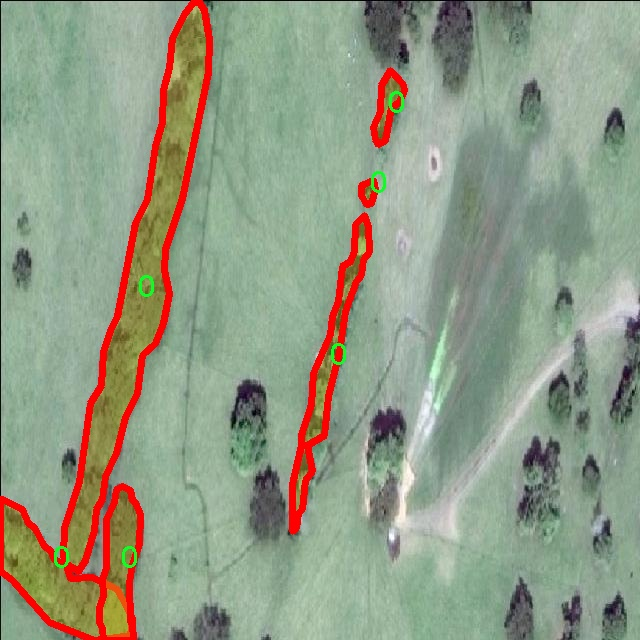

# 灌木篱笆分割系统： yolov8-seg-RevCol

### 1.研究背景与意义

[参考博客](https://gitee.com/YOLOv8_YOLOv11_Segmentation_Studio/projects)

[博客来源](https://kdocs.cn/l/cszuIiCKVNis)

研究背景与意义

随着计算机视觉技术的快速发展，物体检测与分割在多个领域中得到了广泛应用，尤其是在农业、环境监测和城市规划等领域。灌木篱笆作为一种重要的生态景观元素，不仅在美化环境、保护土壤、调节气候等方面发挥着重要作用，同时也在生态系统中扮演着关键角色。因此，准确识别和分割灌木篱笆对于生态保护、资源管理以及城市绿化等工作具有重要的现实意义。

近年来，YOLO（You Only Look Once）系列模型因其高效的实时检测能力而受到广泛关注。YOLOv8作为该系列的最新版本，在准确性和速度上都取得了显著的提升。然而，针对特定应用场景，如灌木篱笆的分割，现有的YOLOv8模型仍存在一定的局限性。为此，基于改进YOLOv8的灌木篱笆分割系统的研究显得尤为重要。通过对YOLOv8模型进行改进，可以更好地适应灌木篱笆的特征，从而提高分割的精度和效率。

本研究所使用的数据集“Cercas_2”包含1900张图像，涵盖了两个类别，其中主要关注的类为“cerca”。这一数据集的构建为模型的训练和验证提供了坚实的基础。通过对这些图像进行实例分割，研究者能够深入分析灌木篱笆的形态特征及其在不同环境下的表现，从而为后续的模型改进提供数据支持。此外，数据集的丰富性和多样性将有助于提高模型的泛化能力，使其在实际应用中能够更好地适应不同的场景和条件。

在实际应用中，基于改进YOLOv8的灌木篱笆分割系统可以广泛应用于生态监测、城市绿化规划以及农业管理等领域。例如，在生态监测中，准确识别和分割灌木篱笆能够帮助研究人员评估生态环境的变化，进而制定相应的保护措施。在城市绿化规划中，分割系统可以为城市设计师提供准确的植被分布信息，从而优化绿化布局，提高城市的生态效益。在农业管理中，分割系统能够帮助农民实时监测灌木生长状况，及时采取措施应对病虫害等问题。

综上所述，基于改进YOLOv8的灌木篱笆分割系统的研究不仅具有重要的理论价值，也具备广泛的应用前景。通过对灌木篱笆的精准分割，研究者能够为生态保护和资源管理提供更为科学的依据，推动相关领域的可持续发展。因此，本研究将为推动计算机视觉技术在生态环境领域的应用提供新的思路和方法，具有重要的学术意义和实践价值。

### 2.图片演示


注意：本项目提供完整的训练源码数据集和训练教程,由于此博客编辑较早,暂不提供权重文件（best.pt）,需要按照6.训练教程进行训练后实现上图效果。

### 3.视频演示

[3.1 视频演示](https://www.bilibili.com/video/BV1S5B1YyEVY/)

### 4.数据集信息

##### 4.1 数据集类别数＆类别名

nc: 2
names: ['0', 'cerca']


##### 4.2 数据集信息简介

数据集信息展示

在本研究中，我们采用了名为“Cercas_2”的数据集，以训练和改进YOLOv8-seg模型，旨在实现高效的灌木篱笆分割系统。该数据集专门设计用于处理与灌木篱笆相关的图像分割任务，具有良好的代表性和多样性，能够有效支持模型的训练和评估。

“Cercas_2”数据集包含两个主要类别，分别为“0”和“cerca”。类别“0”通常代表背景或非目标区域，而“cerca”则专指灌木篱笆的具体实例。这种类别划分不仅有助于模型学习到如何区分目标与背景，还能提高其在实际应用中的准确性和鲁棒性。通过对这两个类别的深入学习，YOLOv8-seg模型能够更好地识别和分割灌木篱笆，进而在图像处理和计算机视觉领域中发挥重要作用。

数据集的构建过程遵循严格的标准，确保了数据的质量和多样性。所有图像均经过精心挑选，涵盖了不同环境、光照条件和视角下的灌木篱笆实例。这种多样性使得模型在训练过程中能够接触到更广泛的场景，从而提升其泛化能力。数据集中不仅包含了清晰的灌木篱笆图像，还包含了一些模糊或部分遮挡的实例，以模拟真实世界中可能遇到的复杂情况。这种设计理念旨在使模型在面对不同挑战时，依然能够保持较高的分割精度。

在数据标注方面，采用了先进的标注工具和技术，确保每个图像中的灌木篱笆区域都被准确地标注。标注过程经过多轮审核，以减少人为错误，提高数据集的可靠性。此外，数据集还提供了丰富的元数据，包括图像的分辨率、拍摄时间和地点等信息，这些信息有助于后续的分析和研究。

为了进一步增强模型的训练效果，我们还对数据集进行了多种数据增强处理，如旋转、缩放、翻转和颜色调整等。这些处理不仅增加了数据集的规模，还提升了模型对不同场景的适应能力，使其在实际应用中表现得更加出色。

在模型训练过程中，我们将“Cercas_2”数据集与YOLOv8-seg模型相结合，利用其强大的特征提取和分割能力，力求实现对灌木篱笆的精准识别与分割。通过不断的迭代训练和优化，我们期望能够显著提高模型在该任务上的性能，最终实现一个高效、准确的灌木篱笆分割系统。

综上所述，“Cercas_2”数据集在本研究中扮演了至关重要的角色，其丰富的类别信息和高质量的图像数据为YOLOv8-seg模型的训练提供了坚实的基础。通过对该数据集的深入分析和利用，我们相信能够在灌木篱笆分割领域取得显著的进展，为相关应用提供更为精准的技术支持。




### 5.项目依赖环境部署教程（零基础手把手教学）

[5.1 环境部署教程链接（零基础手把手教学）](https://www.bilibili.com/video/BV1jG4Ve4E9t/?vd_source=bc9aec86d164b67a7004b996143742dc)


[5.2 安装Python虚拟环境创建和依赖库安装视频教程链接（零基础手把手教学）](https://www.bilibili.com/video/BV1nA4VeYEze/?vd_source=bc9aec86d164b67a7004b996143742dc)

### 6.手把手YOLOV8-seg训练视频教程（零基础手把手教学）

[6.1 手把手YOLOV8-seg训练视频教程（零基础小白有手就能学会）](https://www.bilibili.com/video/BV1cA4VeYETe/?vd_source=bc9aec86d164b67a7004b996143742dc)


按照上面的训练视频教程链接加载项目提供的数据集，运行train.py即可开始训练



     Epoch   gpu_mem       box       obj       cls    labels  img_size
     1/200     0G   0.01576   0.01955  0.007536        22      1280: 100%|██████████| 849/849 [14:42<00:00,  1.04s/it]
               Class     Images     Labels          P          R     mAP@.5 mAP@.5:.95: 100%|██████████| 213/213 [01:14<00:00,  2.87it/s]
                 all       3395      17314      0.994      0.957      0.0957      0.0843

     Epoch   gpu_mem       box       obj       cls    labels  img_size
     2/200     0G   0.01578   0.01923  0.007006        22      1280: 100%|██████████| 849/849 [14:44<00:00,  1.04s/it]
               Class     Images     Labels          P          R     mAP@.5 mAP@.5:.95: 100%|██████████| 213/213 [01:12<00:00,  2.95it/s]
                 all       3395      17314      0.996      0.956      0.0957      0.0845

     Epoch   gpu_mem       box       obj       cls    labels  img_size
     3/200     0G   0.01561    0.0191  0.006895        27      1280: 100%|██████████| 849/849 [10:56<00:00,  1.29it/s]
               Class     Images     Labels          P          R     mAP@.5 mAP@.5:.95: 100%|███████   | 187/213 [00:52<00:00,  4.04it/s]
                 all       3395      17314      0.996      0.957      0.0957      0.0845


### 7.50+种全套YOLOV8-seg创新点加载调参实验视频教程（一键加载写好的改进模型的配置文件）

[7.1 50+种全套YOLOV8-seg创新点加载调参实验视频教程（一键加载写好的改进模型的配置文件）](https://www.bilibili.com/video/BV1Hw4VePEXv/?vd_source=bc9aec86d164b67a7004b996143742dc)

### YOLOV8-seg算法简介

原始YOLOv8-seg算法原理

YOLOv8-seg算法是由Ultralytics团队在YOLOv5的基础上进行的一次重大更新，旨在提高目标检测和图像分割的性能。该算法于2023年1月发布，吸收了近两年半内的多项实际验证的改进，体现了YOLO系列模型在目标检测领域的持续演进。YOLOv8模型的设计理念围绕着快速、准确和易于使用的原则，成为了广泛应用于目标检测、图像分割和图像分类任务的理想选择。

YOLOv8-seg的网络结构由三个主要部分组成：输入层、主干网络（Backbone）和检测头（Head）。在输入层，YOLOv8-seg采用了640x640的默认图像尺寸，然而在实际应用中，图像的长宽比往往各不相同。为了解决这一问题，YOLOv8-seg在推理阶段采用自适应图像缩放策略，确保长边按比例缩小至指定尺寸后，对短边进行填充，从而减少信息冗余并提高目标检测的速度与精度。此外，YOLOv8-seg在训练过程中使用了Mosaic数据增强技术，尽管在最后10个训练轮次中停止使用此增强方法，以避免对数据真实分布的破坏。

在主干网络部分，YOLOv8-seg引入了C2f模块来替代YOLOv5中的C3模块。C2f模块的设计灵感来源于YOLOv7中的ELAN模块，采用了更多的跳层连接，增强了梯度流信息的丰富性。这种结构不仅保证了模型的轻量化，还提高了特征提取的精度。YOLOv8-seg在颈部网络（Neck）中同样进行了结构优化，将所有的C3模块替换为C2f模块，并去除了两处上采样之前的卷积连接层，使得不同阶段输出的特征可以直接进行上采样，进一步提高了计算效率。

在检测头部分，YOLOv8-seg的设计发生了显著变化，采用了解耦合头（Decoupled Head）结构。这一结构将分类和定位任务分为两个并行的分支，分别提取类别和位置特征。分类任务更注重特征图中提取到的特征与已有类别的相似性，而定位任务则关注边界框与真实框之间的位置关系。通过这种解耦合的方式，YOLOv8-seg在收敛速度和预测精度上均有所提升。此外，YOLOv8-seg摒弃了传统的Anchor-Based方法，转而采用Anchor-Free的策略，直接预测目标的中心位置。该方法不仅简化了模型结构，还增强了模型的泛化能力。

在损失函数的设计上，YOLOv8-seg引入了任务对齐学习（Task Alignment Learning，TAL）机制，以提高分类和定位任务的协同效果。通过引入分类分数和交并比（IoU）的高次幂乘积作为衡量任务对齐程度的指标，YOLOv8-seg在分类和定位损失函数中均考虑了这一指标，确保模型在定位和分类任务中都能取得良好的性能。

YOLOv8-seg在模型性能上表现出色，尤其是在COCO数据集上的测试结果显示，YOLOv8-seg在相同模型尺寸下，参数量没有显著增加的情况下，取得了更高的精度和更快的推理速度。这使得YOLOv8-seg在实时性和准确性兼顾的任务中，尤其适用于如机器人垃圾分拣系统等应用场景。

总的来说，YOLOv8-seg算法通过对输入层、主干网络、颈部网络和检测头的全面优化，结合了最新的深度学习技术，展现出更高的检测精度和更快的推理速度。其创新的解耦合头结构和无锚框方法，使得YOLOv8-seg在目标检测和图像分割领域具备了更强的适应性和灵活性，为未来的研究和应用提供了广阔的前景。


### 9.系统功能展示（检测对象为举例，实际内容以本项目数据集为准）

图9.1.系统支持检测结果表格显示

  图9.2.系统支持置信度和IOU阈值手动调节

  图9.3.系统支持自定义加载权重文件best.pt(需要你通过步骤5中训练获得)

  图9.4.系统支持摄像头实时识别

  图9.5.系统支持图片识别

  图9.6.系统支持视频识别

  图9.7.系统支持识别结果文件自动保存

  图9.8.系统支持Excel导出检测结果数据


### 10.50+种全套YOLOV8-seg创新点原理讲解（非科班也可以轻松写刊发刊，V11版本正在科研待更新）

#### 10.1 由于篇幅限制，每个创新点的具体原理讲解就不一一展开，具体见下列网址中的创新点对应子项目的技术原理博客网址【Blog】：


[10.1 50+种全套YOLOV8-seg创新点原理讲解链接](https://gitee.com/qunmasj/good)

#### 10.2 部分改进模块原理讲解(完整的改进原理见上图和技术博客链接)【如果此小节的图加载失败可以通过CSDN或者Github搜索该博客的标题访问原始博客，原始博客图片显示正常】

### YOLOv8简介


由上图可以看出，C2中每个BottlNeck的输入Tensor的通道数channel都只是上一级的0.5倍，因此计算量明显降低。从另一方面讲，梯度流的增加，t也能够明显提升收敛速度和收敛效果。
C2i模块首先以输入tensor(n.c.h.w)经过Conv1层进行split拆分，分成两部分(n,0.5c,h,w)，一部分直接经过n个Bottlenck，另一部分经过每一操作层后都会以(n.0.5c,h,w)的尺寸进行Shortcut，最后通过Conv2层卷积输出。也就是对应n+2的Shortcut(第一层Conv1的分支tensor和split后的tensor为2+n个bottenlenneck)。
#### Neck
YOLOv8的Neck采用了PANet结构，如下图所示。

Backbone最后SPPF模块(Layer9)之后H、W经过32倍下采样，对应地Layer4经过8倍下采样，Layer6经过16倍下采样。输入图片分辨率为640*640，得到Layer4、Layer6、Layer9的分辨率分别为80*80、40*40和20*20。
Layer4、Layer6、Layer9作为PANet结构的输入，经过上采样，通道融合，最终将PANet的三个输出分支送入到Detect head中进行Loss的计算或结果解算。
与FPN(单向，自上而下)不同的是，PANet是一个双向通路网络，引入了自下向上的路径，使得底层信息更容易传递到顶层。
#### Head
Head部分相比Yolov5改动较大，直接将耦合头改为类似Yolo的解耦头结构(Decoupled-Head)，将回归分支和预测分支分离，并针对回归分支使用了Distribution Focal Loss策略中提出的积分形式表示法。之前的目标检测网络将回归坐标作为一个确定性单值进行预测，DFL将坐标转变成一个分布。


### LSKNet的架构
该博客提出的结构层级依次为：

LSK module（大核卷积序列+空间选择机制） < LSK Block （LK Selection + FFN）<LSKNet（N个LSK Block）


#### LSK 模块

LSK Block
LSKNet 是主干网络中的一个可重复堆叠的块（Block），每个LSK Block包括两个残差子块，即大核选择子块（Large Kernel Selection，LK Selection）和前馈网络子块（Feed-forward Network ，FFN），如图8。LK Selection子块根据需要动态地调整网络的感受野，FFN子块用于通道混合和特征细化，由一个全连接层、一个深度卷积、一个 GELU 激活和第二个全连接层组成。

LSK module（LSK 模块，图4）由一个大核卷积序列（large kernel convolutions）和一个空间核选择机制（spatial kernel selection mechanism）组成，被嵌入到了LSK Block 的 LK Selection子块中。

#### Large Kernel Convolutions
因为不同类型的目标对背景信息的需求不同，这就需要模型能够自适应选择不同大小的背景范围。因此，作者通过解耦出一系列具有大卷积核、且不断扩张的Depth-wise 卷积，构建了一个更大感受野的网络。

具体地，假设序列中第i个Depth-wise 卷积核的大小为 ，扩张率为 d，感受野为 ，它们满足以下关系：


卷积核大小和扩张率的增加保证了感受野能够快速增大。此外，我们设置了扩张率的上限，以保证扩张卷积不会引入特征图之间的差距。


Table2的卷积核大小可根据公式（1）和（2）计算，详见下图：


这样设计的好处有两点。首先，能够产生具有多种不同大小感受野的特征，便于后续的核选择；第二，序列解耦比简单的使用一个大型卷积核效果更好。如上图表2所示，解耦操作相对于标准的大型卷积核，有效地将低了模型的参数量。

为了从输入数据  的不同区域获取丰富的背景信息特征，可采用一系列解耦的、不用感受野的Depth-wise 卷积核：


其中，是卷积核为 、扩张率为  的Depth-wise 卷积操作。假设有个解耦的卷积核，每个卷积操作后又要经过一个的卷积层进行空间特征向量的通道融合。


之后，针对不同的目标，可基于获取的多尺度特征，通过下文中的选择机制动态选择合适的卷积核大小。

这一段的意思可以简单理解为：

把一个大的卷积核拆成了几个小的卷积核，比如一个大小为5，扩张率为1的卷积核加上一个大小为7，扩张率为3的卷积核，感受野为23，与一个大小为23，扩张率为1的卷积核的感受野是一样的。因此可用两个小的卷积核替代一个大的卷积核，同理一个大小为29的卷积核也可以用三个小的卷积代替（Table 2），这样可以有效的减少参数，且更灵活。

将输入数据依次通过这些小的卷积核（公式3），并在每个小的卷积核后面接上一个1×1的卷积进行通道融合（公式4）。

#### Spatial Kernel Selection
为了使模型更关注目标在空间上的重点背景信息，作者使用空间选择机制从不同尺度的大卷积核中对特征图进行空间选择。

首先，将来自于不同感受野卷积核的特征进行concate拼接，然后，应用通道级的平均池化和最大池化提取空间关系，其中， 和  是平均池化和最大池化后的空间特征描述符。为了实现不同空间描述符的信息交互，作者利用卷积层将空间池化特征进行拼接，将2个通道的池化特征转换为N个空间注意力特征图，之后，将Sigmoid激活函数应用到每一个空间注意力特征图，可获得每个解耦的大卷积核所对应的独立的空间选择掩膜，又然后，将解耦后的大卷积核序列的特征与对应的空间选择掩膜进行加权处理，并通过卷积层进行融合获得注意力特征 ，最后LSK module的输出可通过输入特征  与注意力特征  的逐元素点成获得，公式对应于结构图上的操作如下：


### 11.项目核心源码讲解（再也不用担心看不懂代码逻辑）

#### 11.1 ultralytics\nn\extra_modules\ops_dcnv3\modules\__init__.py

以下是对提供代码的核心部分进行分析和详细注释的结果：

```python
# --------------------------------------------------------
# InternImage
# Copyright (c) 2022 OpenGVLab
# Licensed under The MIT License [see LICENSE for details]
# --------------------------------------------------------

# 从当前包中导入 DCNv3、DCNv3_pytorch 和 DCNv3_DyHead 模块
from .dcnv3 import DCNv3, DCNv3_pytorch, DCNv3_DyHead

# 以上代码的核心部分是导入 DCNv3 相关的模块，这些模块可能用于实现深度学习中的某些功能。
# 具体来说：
# - DCNv3：可能是一个实现了深度可分离卷积（Deformable Convolution）的类或函数。
# - DCNv3_pytorch：可能是 DCNv3 在 PyTorch 框架下的实现。
# - DCNv3_DyHead：可能是与动态头部（Dynamic Head）相关的实现，通常用于目标检测等任务。

# 这些模块的具体功能和实现细节需要查看 dcnv3.py 文件中的定义。
```

以上是对代码的核心部分进行了提炼和详细注释，解释了每个导入模块的可能用途和背景。

这个文件是一个Python模块的初始化文件，位于`ultralytics/nn/extra_modules/ops_dcnv3/modules/`目录下。文件的开头包含了一些版权信息，表明该代码是由OpenGVLab在2022年开发的，并且使用MIT许可证进行授权，这意味着该代码可以自由使用和修改，但需要遵循许可证的条款。

在文件的主体部分，使用了`from ... import ...`语句从同一目录下的`dcnv3`模块中导入了三个类或函数：`DCNv3`、`DCNv3_pytorch`和`DCNv3_DyHead`。这些导入的内容可能是与深度学习相关的模块，特别是在计算机视觉任务中常用的动态卷积（Dynamic Convolution）实现。

通过这个初始化文件，用户在导入`ultralytics.nn.extra_modules.ops_dcnv3.modules`模块时，可以直接使用`DCNv3`、`DCNv3_pytorch`和`DCNv3_DyHead`这三个功能，而不需要单独去导入`dcnv3`模块。这种做法有助于提高代码的可读性和可维护性，使得模块的使用更加方便。总的来说，这个文件的主要作用是组织和管理模块中的功能，使得它们能够被其他部分的代码轻松访问。

#### 11.2 ultralytics\utils\callbacks\neptune.py

以下是代码中最核心的部分，并附上详细的中文注释：

```python
# 导入必要的库
from ultralytics.utils import LOGGER, SETTINGS, TESTS_RUNNING

# 尝试导入 NeptuneAI 相关库并进行初始化
try:
    assert not TESTS_RUNNING  # 确保不在测试模式下
    assert SETTINGS['neptune'] is True  # 确保 Neptune 集成已启用
    import neptune
    from neptune.types import File

    assert hasattr(neptune, '__version__')  # 确保 Neptune 版本可用

    run = None  # 初始化 NeptuneAI 实验记录实例

except (ImportError, AssertionError):
    neptune = None  # 如果导入失败，设置 neptune 为 None


def _log_scalars(scalars, step=0):
    """将标量数据记录到 NeptuneAI 实验记录器中。"""
    if run:  # 如果 run 实例存在
        for k, v in scalars.items():  # 遍历标量字典
            run[k].append(value=v, step=step)  # 记录每个标量值


def _log_images(imgs_dict, group=''):
    """将图像记录到 NeptuneAI 实验记录器中。"""
    if run:  # 如果 run 实例存在
        for k, v in imgs_dict.items():  # 遍历图像字典
            run[f'{group}/{k}'].upload(File(v))  # 上传每个图像文件


def on_pretrain_routine_start(trainer):
    """在训练例程开始前调用的回调函数。"""
    try:
        global run
        # 初始化 Neptune 运行
        run = neptune.init_run(project=trainer.args.project or 'YOLOv8', name=trainer.args.name, tags=['YOLOv8'])
        # 记录超参数配置
        run['Configuration/Hyperparameters'] = {k: '' if v is None else v for k, v in vars(trainer.args).items()}
    except Exception as e:
        LOGGER.warning(f'WARNING ⚠️ NeptuneAI 安装但未正确初始化，未记录此运行。 {e}')


def on_train_epoch_end(trainer):
    """每个训练周期结束时调用的回调函数。"""
    # 记录训练损失和学习率
    _log_scalars(trainer.label_loss_items(trainer.tloss, prefix='train'), trainer.epoch + 1)
    _log_scalars(trainer.lr, trainer.epoch + 1)
    if trainer.epoch == 1:  # 在第一个周期时记录图像
        _log_images({f.stem: str(f) for f in trainer.save_dir.glob('train_batch*.jpg')}, 'Mosaic')


def on_train_end(trainer):
    """训练结束时调用的回调函数。"""
    if run:  # 如果 run 实例存在
        # 记录最终结果和模型
        files = [
            'results.png', 'confusion_matrix.png', 'confusion_matrix_normalized.png',
            *(f'{x}_curve.png' for x in ('F1', 'PR', 'P', 'R'))]
        files = [(trainer.save_dir / f) for f in files if (trainer.save_dir / f).exists()]  # 过滤存在的文件
        for f in files:
            _log_plot(title=f.stem, plot_path=f)  # 记录每个图表
        # 记录最终模型
        run[f'weights/{trainer.args.name or trainer.args.task}/{str(trainer.best.name)}'].upload(File(str(trainer.best)))


# 定义回调函数字典，如果 neptune 可用则包含相关回调
callbacks = {
    'on_pretrain_routine_start': on_pretrain_routine_start,
    'on_train_epoch_end': on_train_epoch_end,
    'on_train_end': on_train_end} if neptune else {}
```

### 代码核心部分解释：
1. **NeptuneAI 初始化**：尝试导入并初始化 NeptuneAI，用于记录实验数据。
2. **日志记录函数**：定义了 `_log_scalars` 和 `_log_images` 函数，用于记录标量数据和图像。
3. **回调函数**：
   - `on_pretrain_routine_start`：在训练开始前初始化 Neptune 记录。
   - `on_train_epoch_end`：在每个训练周期结束时记录损失和学习率。
   - `on_train_end`：在训练结束时记录最终结果和模型。 

通过这些核心部分，代码实现了对训练过程的监控和数据记录，便于后续分析和可视化。

这个程序文件是用于与NeptuneAI进行集成的回调函数实现，主要用于在训练YOLO模型时记录和上传各种训练指标、图像和图表。文件开头导入了一些必要的模块和设置，并尝试初始化NeptuneAI的实验记录器。如果在导入过程中出现错误（如Neptune未安装或设置不正确），则会将`neptune`设置为`None`，以避免后续代码执行时出错。

文件中定义了几个私有函数，用于记录不同类型的数据。`_log_scalars`函数用于记录标量数据，比如损失值和学习率，它会遍历传入的字典，将每个键值对以步骤的形式上传到Neptune。`_log_images`函数则用于上传图像，接受一个字典，其中包含图像的文件路径，并将其上传到指定的组下。`_log_plot`函数用于记录图表，读取指定路径的图像文件，并将其上传到Neptune，图像会被处理为没有坐标轴的形式。

接下来，文件定义了一系列回调函数，这些函数在训练过程中的特定时刻被调用。`on_pretrain_routine_start`函数在训练开始前被调用，用于初始化Neptune的运行实例，并记录超参数配置。`on_train_epoch_end`函数在每个训练周期结束时被调用，记录训练损失和学习率，并在第一个周期结束时上传训练图像。`on_fit_epoch_end`函数在每个训练和验证周期结束时被调用，记录模型的配置信息和指标。`on_val_end`函数在验证结束时被调用，上传验证图像。最后，`on_train_end`函数在训练结束时被调用，记录最终结果和混淆矩阵等图表，并上传最佳模型的权重。

最后，程序将所有的回调函数以字典的形式存储在`callbacks`变量中，如果Neptune未初始化，则该字典为空。这些回调函数可以在训练过程中被自动调用，以便实时记录和监控模型的训练进展。

#### 11.3 ultralytics\data\base.py

以下是经过简化并添加详细中文注释的核心代码部分：

```python
import glob
import os
import random
from copy import deepcopy
from pathlib import Path
import cv2
import numpy as np
from torch.utils.data import Dataset

class BaseDataset(Dataset):
    """
    基础数据集类，用于加载和处理图像数据。

    参数:
        img_path (str): 图像文件夹的路径。
        imgsz (int, optional): 图像大小，默认为640。
        augment (bool, optional): 如果为True，则应用数据增强，默认为True。
        classes (list): 包含的类别列表，默认为None。
        fraction (float): 使用的数据集比例，默认为1.0（使用所有数据）。
    """

    def __init__(self, img_path, imgsz=640, augment=True, classes=None, fraction=1.0):
        """初始化BaseDataset，配置和选项。"""
        super().__init__()
        self.img_path = img_path  # 图像路径
        self.imgsz = imgsz  # 图像大小
        self.augment = augment  # 是否进行数据增强
        self.im_files = self.get_img_files(self.img_path)  # 获取图像文件列表
        self.labels = self.get_labels()  # 获取标签
        self.update_labels(include_class=classes)  # 更新标签以仅包含指定类别
        self.ni = len(self.labels)  # 数据集中图像数量

    def get_img_files(self, img_path):
        """读取图像文件。"""
        f = []  # 存储图像文件
        for p in img_path if isinstance(img_path, list) else [img_path]:
            p = Path(p)  # 处理路径
            if p.is_dir():  # 如果是目录
                f += glob.glob(str(p / '**' / '*.*'), recursive=True)  # 获取所有图像文件
            elif p.is_file():  # 如果是文件
                with open(p) as t:
                    t = t.read().strip().splitlines()  # 读取文件内容
                    parent = str(p.parent) + os.sep
                    f += [x.replace('./', parent) if x.startswith('./') else x for x in t]  # 转换为全局路径
            else:
                raise FileNotFoundError(f'{p} 不存在')
        im_files = sorted(x for x in f if x.split('.')[-1].lower() in ['jpg', 'jpeg', 'png'])  # 过滤有效图像格式
        assert im_files, f'没有在 {img_path} 中找到图像'
        if self.fraction < 1:
            im_files = im_files[:round(len(im_files) * self.fraction)]  # 根据比例截取图像文件
        return im_files

    def update_labels(self, include_class):
        """更新标签，仅包含指定类别（可选）。"""
        for i in range(len(self.labels)):
            if include_class is not None:
                cls = self.labels[i]['cls']
                bboxes = self.labels[i]['bboxes']
                j = np.isin(cls, include_class)  # 仅保留指定类别的索引
                self.labels[i]['cls'] = cls[j]
                self.labels[i]['bboxes'] = bboxes[j]

    def load_image(self, i):
        """加载数据集中索引为 'i' 的图像，返回图像及其原始和调整后的尺寸。"""
        im = cv2.imread(self.im_files[i])  # 读取图像
        if im is None:
            raise FileNotFoundError(f'未找到图像 {self.im_files[i]}')
        h0, w0 = im.shape[:2]  # 获取原始高度和宽度
        im = cv2.resize(im, (self.imgsz, self.imgsz))  # 调整图像大小
        return im, (h0, w0), im.shape[:2]  # 返回图像及其尺寸

    def __getitem__(self, index):
        """返回给定索引的图像和标签信息。"""
        label = deepcopy(self.labels[index])  # 深拷贝标签信息
        label['img'], label['ori_shape'], label['resized_shape'] = self.load_image(index)  # 加载图像
        return label  # 返回标签信息

    def __len__(self):
        """返回数据集中标签的数量。"""
        return len(self.labels)

    def get_labels(self):
        """用户可以自定义标签格式，这里需要返回标签字典。"""
        raise NotImplementedError  # 需要用户实现
```

### 代码说明：
1. **BaseDataset类**：这是一个继承自`torch.utils.data.Dataset`的基础数据集类，主要用于加载和处理图像数据。
2. **初始化方法**：接收图像路径、图像大小、是否增强、类别等参数，并初始化相应的属性。
3. **get_img_files方法**：用于读取指定路径下的图像文件，支持目录和文件列表的输入，返回有效的图像文件路径。
4. **update_labels方法**：根据给定的类别更新标签，仅保留指定类别的标签信息。
5. **load_image方法**：根据索引加载图像，调整图像大小，并返回图像及其原始和调整后的尺寸。
6. **getitem和len方法**：实现了数据集的索引访问和长度计算，支持通过索引获取图像和标签信息。

### 注意：
- `get_labels`方法需要用户根据自己的需求实现，确保返回的标签格式符合要求。

这个程序文件是一个用于加载和处理图像数据的基础数据集类，名为 `BaseDataset`，它是从 PyTorch 的 `Dataset` 类继承而来的。这个类主要用于在训练深度学习模型时处理图像数据，尤其是与 YOLO（You Only Look Once）目标检测模型相关的任务。

在类的初始化方法中，接收多个参数来配置数据集的加载和处理方式，包括图像路径、图像大小、是否缓存图像、数据增强、超参数、前缀、批量大小、步幅、填充、单类训练、包含的类别和数据集的使用比例等。初始化过程中，类会调用一些方法来获取图像文件和标签，并根据需要更新标签。

`get_img_files` 方法用于读取指定路径下的图像文件。它支持读取文件夹中的所有图像，或者从文件中读取图像路径。该方法还会检查图像格式，并根据给定的比例返回相应数量的图像文件。

`update_labels` 方法用于更新标签，只保留指定类别的标签信息。如果设置了单类训练，它会将所有标签的类别标记为 0。

`load_image` 方法负责加载指定索引的图像。如果图像已经缓存，它会直接返回；否则，它会尝试从磁盘读取图像，并根据需要调整图像大小以适应训练要求。该方法还会在数据增强模式下将图像添加到缓冲区，以便后续处理。

`cache_images` 方法用于将图像缓存到内存或磁盘，以加快后续加载速度。它会使用多线程来并行处理图像加载，并显示缓存进度。

`check_cache_ram` 方法检查当前系统的可用内存，以确定是否可以将图像缓存到内存中。它会根据图像的大小和数量计算所需的内存，并与系统可用内存进行比较。

`set_rectangle` 方法用于设置 YOLO 检测的边界框形状为矩形，以适应不同图像的长宽比。

`__getitem__` 方法是获取数据集中特定索引的图像和标签信息，并对其进行转换。`get_image_and_label` 方法则负责获取图像和标签信息，并返回包含这些信息的字典。

`__len__` 方法返回数据集中标签的数量。

`update_labels_info` 方法可以自定义标签格式的更新。

`build_transforms` 和 `get_labels` 方法是抽象方法，用户需要根据自己的需求实现数据增强和标签格式的获取。

总体而言，这个类提供了一个灵活的框架，用于处理图像数据集，支持多种配置选项，以适应不同的训练需求。

#### 11.4 ultralytics\utils\triton.py

以下是代码中最核心的部分，并附上详细的中文注释：

```python
from typing import List
from urllib.parse import urlsplit
import numpy as np

class TritonRemoteModel:
    """
    与远程Triton推理服务器模型交互的客户端。

    属性:
        endpoint (str): Triton服务器上模型的名称。
        url (str): Triton服务器的URL。
        triton_client: Triton客户端（HTTP或gRPC）。
        InferInput: Triton客户端的输入类。
        InferRequestedOutput: Triton客户端的输出请求类。
        input_formats (List[str]): 模型输入的数据类型。
        np_input_formats (List[type]): 模型输入的numpy数据类型。
        input_names (List[str]): 模型输入的名称。
        output_names (List[str]): 模型输出的名称。
    """

    def __init__(self, url: str, endpoint: str = '', scheme: str = ''):
        """
        初始化TritonRemoteModel。

        参数可以单独提供，也可以从形式为
            <scheme>://<netloc>/<endpoint>/<task_name>的集合'url'参数中解析。

        参数:
            url (str): Triton服务器的URL。
            endpoint (str): Triton服务器上模型的名称。
            scheme (str): 通信方案（'http'或'gRPC'）。
        """
        if not endpoint and not scheme:  # 从URL字符串解析所有参数
            splits = urlsplit(url)
            endpoint = splits.path.strip('/').split('/')[0]  # 获取模型名称
            scheme = splits.scheme  # 获取通信方案
            url = splits.netloc  # 获取服务器地址

        self.endpoint = endpoint  # 设置模型名称
        self.url = url  # 设置服务器URL

        # 根据通信方案选择Triton客户端
        if scheme == 'http':
            import tritonclient.http as client  # 导入HTTP客户端
            self.triton_client = client.InferenceServerClient(url=self.url, verbose=False, ssl=False)
            config = self.triton_client.get_model_config(endpoint)  # 获取模型配置
        else:
            import tritonclient.grpc as client  # 导入gRPC客户端
            self.triton_client = client.InferenceServerClient(url=self.url, verbose=False, ssl=False)
            config = self.triton_client.get_model_config(endpoint, as_json=True)['config']  # 获取模型配置

        # 按字母顺序排序输出名称
        config['output'] = sorted(config['output'], key=lambda x: x.get('name'))

        # 定义模型属性
        type_map = {'TYPE_FP32': np.float32, 'TYPE_FP16': np.float16, 'TYPE_UINT8': np.uint8}  # 数据类型映射
        self.InferRequestedOutput = client.InferRequestedOutput  # 设置输出请求类
        self.InferInput = client.InferInput  # 设置输入类
        self.input_formats = [x['data_type'] for x in config['input']]  # 获取输入数据类型
        self.np_input_formats = [type_map[x] for x in self.input_formats]  # 获取numpy数据类型
        self.input_names = [x['name'] for x in config['input']]  # 获取输入名称
        self.output_names = [x['name'] for x in config['output']]  # 获取输出名称

    def __call__(self, *inputs: np.ndarray) -> List[np.ndarray]:
        """
        使用给定的输入调用模型。

        参数:
            *inputs (List[np.ndarray]): 模型的输入数据。

        返回:
            List[np.ndarray]: 模型输出。
        """
        infer_inputs = []  # 存储输入数据的列表
        input_format = inputs[0].dtype  # 获取输入数据的类型
        for i, x in enumerate(inputs):
            # 如果输入数据类型与模型要求不匹配，则转换数据类型
            if x.dtype != self.np_input_formats[i]:
                x = x.astype(self.np_input_formats[i])
            # 创建InferInput对象并设置数据
            infer_input = self.InferInput(self.input_names[i], [*x.shape], self.input_formats[i].replace('TYPE_', ''))
            infer_input.set_data_from_numpy(x)  # 从numpy数组设置数据
            infer_inputs.append(infer_input)  # 添加到输入列表

        # 创建输出请求对象
        infer_outputs = [self.InferRequestedOutput(output_name) for output_name in self.output_names]
        # 调用Triton客户端进行推理
        outputs = self.triton_client.infer(model_name=self.endpoint, inputs=infer_inputs, outputs=infer_outputs)

        # 返回输出数据
        return [outputs.as_numpy(output_name).astype(input_format) for output_name in self.output_names]
```

### 代码说明：
1. **类的定义**：`TritonRemoteModel`类用于与远程Triton推理服务器进行交互，包含了模型的基本信息和推理方法。
2. **初始化方法**：在`__init__`方法中，解析输入的URL并设置模型的名称和服务器地址，选择合适的Triton客户端（HTTP或gRPC），并获取模型的配置。
3. **推理调用**：`__call__`方法实现了对模型的调用，接受输入数据，进行必要的数据类型转换，创建输入对象，并最终通过Triton客户端进行推理，返回模型的输出结果。

这个程序文件定义了一个名为 `TritonRemoteModel` 的类，用于与远程的 Triton 推理服务器模型进行交互。Triton 是一个用于部署和管理机器学习模型的服务器，支持多种推理后端。

在类的文档字符串中，列出了几个主要的属性，包括模型的名称、服务器的 URL、客户端类型、输入输出的格式和名称等。这些属性帮助用户了解如何与 Triton 服务器进行交互。

类的构造函数 `__init__` 接受三个参数：`url`、`endpoint` 和 `scheme`。`url` 是 Triton 服务器的地址，`endpoint` 是模型的名称，`scheme` 指定了通信协议（HTTP 或 gRPC）。如果没有提供 `endpoint` 和 `scheme`，则会从 `url` 中解析出这些信息。

在构造函数中，首先根据传入的 URL 解析出模型的名称和通信协议。接着，根据协议选择相应的 Triton 客户端库（HTTP 或 gRPC），并使用该客户端获取模型的配置。模型的输出名称会按字母顺序排序，以便于后续处理。

然后，代码定义了一些属性，包括输入输出的格式和名称。输入格式通过模型配置中的数据类型进行映射，使用一个字典将 Triton 的数据类型转换为 NumPy 的数据类型。

类的 `__call__` 方法允许用户通过实例化的对象直接调用模型进行推理。该方法接受多个 NumPy 数组作为输入，首先检查输入数据的类型是否与模型要求的类型一致，如果不一致，则进行类型转换。接着，创建输入对象并将数据设置到这些对象中。

最后，使用 Triton 客户端的 `infer` 方法进行推理，并将输出结果转换为 NumPy 数组返回。这个方法返回的是一个包含模型输出的列表，输出的类型与输入类型一致。

总的来说，这个文件提供了一个方便的接口，用于与 Triton 推理服务器进行交互，支持多种输入输出格式的处理，使得用户能够轻松地在远程模型上进行推理。

### 12.系统整体结构（节选）

### 程序整体功能和构架概括

该程序是一个与深度学习模型（特别是YOLO系列模型）相关的框架，主要用于图像数据的处理、模型训练、推理和监控。它的构架分为多个模块，每个模块负责特定的功能。整体上，程序可以分为以下几个主要部分：

1. **模型操作模块**：包含动态卷积（DCNv3）相关的实现，提供了模型构建和操作的基础。
2. **数据处理模块**：负责加载和处理图像数据集，支持数据增强和标签更新，以适应不同的训练需求。
3. **回调和监控模块**：与NeptuneAI集成，提供训练过程中的实时监控和指标记录功能，便于用户跟踪模型的训练进展。
4. **推理模块**：与Triton推理服务器交互，支持远程模型的推理，允许用户在部署环境中进行高效的模型推理。

### 文件功能整理表

| 文件路径                                           | 功能描述                                                         |
|---------------------------------------------------|------------------------------------------------------------------|
| `ultralytics/nn/extra_modules/ops_dcnv3/modules/__init__.py` | 初始化动态卷积模块，导入DCNv3相关的类和函数，以便于其他模块使用。 |
| `ultralytics/utils/callbacks/neptune.py`         | 实现与NeptuneAI的集成，记录训练过程中的指标、图像和图表，便于监控和分析。 |
| `ultralytics/data/base.py`                        | 定义基础数据集类，负责加载和处理图像数据，支持数据增强和标签更新。   |
| `ultralytics/utils/triton.py`                     | 提供与Triton推理服务器的接口，支持远程模型的推理，处理输入输出格式。   |

这个表格总结了每个文件的主要功能，帮助理解程序的整体架构和各个模块之间的关系。

### 13.图片、视频、摄像头图像分割Demo(去除WebUI)代码

在这个博客小节中，我们将讨论如何在不使用WebUI的情况下，实现图像分割模型的使用。本项目代码已经优化整合，方便用户将分割功能嵌入自己的项目中。
核心功能包括图片、视频、摄像头图像的分割，ROI区域的轮廓提取、类别分类、周长计算、面积计算、圆度计算以及颜色提取等。
这些功能提供了良好的二次开发基础。

### 核心代码解读

以下是主要代码片段，我们会为每一块代码进行详细的批注解释：

```python
import random
import cv2
import numpy as np
from PIL import ImageFont, ImageDraw, Image
from hashlib import md5
from model import Web_Detector
from chinese_name_list import Label_list

# 根据名称生成颜色
def generate_color_based_on_name(name):
    ......

# 计算多边形面积
def calculate_polygon_area(points):
    return cv2.contourArea(points.astype(np.float32))

...
# 绘制中文标签
def draw_with_chinese(image, text, position, font_size=20, color=(255, 0, 0)):
    image_pil = Image.fromarray(cv2.cvtColor(image, cv2.COLOR_BGR2RGB))
    draw = ImageDraw.Draw(image_pil)
    font = ImageFont.truetype("simsun.ttc", font_size, encoding="unic")
    draw.text(position, text, font=font, fill=color)
    return cv2.cvtColor(np.array(image_pil), cv2.COLOR_RGB2BGR)

# 动态调整参数
def adjust_parameter(image_size, base_size=1000):
    max_size = max(image_size)
    return max_size / base_size

# 绘制检测结果
def draw_detections(image, info, alpha=0.2):
    name, bbox, conf, cls_id, mask = info['class_name'], info['bbox'], info['score'], info['class_id'], info['mask']
    adjust_param = adjust_parameter(image.shape[:2])
    spacing = int(20 * adjust_param)

    if mask is None:
        x1, y1, x2, y2 = bbox
        aim_frame_area = (x2 - x1) * (y2 - y1)
        cv2.rectangle(image, (x1, y1), (x2, y2), color=(0, 0, 255), thickness=int(3 * adjust_param))
        image = draw_with_chinese(image, name, (x1, y1 - int(30 * adjust_param)), font_size=int(35 * adjust_param))
        y_offset = int(50 * adjust_param)  # 类别名称上方绘制，其下方留出空间
    else:
        mask_points = np.concatenate(mask)
        aim_frame_area = calculate_polygon_area(mask_points)
        mask_color = generate_color_based_on_name(name)
        try:
            overlay = image.copy()
            cv2.fillPoly(overlay, [mask_points.astype(np.int32)], mask_color)
            image = cv2.addWeighted(overlay, 0.3, image, 0.7, 0)
            cv2.drawContours(image, [mask_points.astype(np.int32)], -1, (0, 0, 255), thickness=int(8 * adjust_param))

            # 计算面积、周长、圆度
            area = cv2.contourArea(mask_points.astype(np.int32))
            perimeter = cv2.arcLength(mask_points.astype(np.int32), True)
            ......

            # 计算色彩
            mask = np.zeros(image.shape[:2], dtype=np.uint8)
            cv2.drawContours(mask, [mask_points.astype(np.int32)], -1, 255, -1)
            color_points = cv2.findNonZero(mask)
            ......

            # 绘制类别名称
            x, y = np.min(mask_points, axis=0).astype(int)
            image = draw_with_chinese(image, name, (x, y - int(30 * adjust_param)), font_size=int(35 * adjust_param))
            y_offset = int(50 * adjust_param)

            # 绘制面积、周长、圆度和色彩值
            metrics = [("Area", area), ("Perimeter", perimeter), ("Circularity", circularity), ("Color", color_str)]
            for idx, (metric_name, metric_value) in enumerate(metrics):
                ......

    return image, aim_frame_area

# 处理每帧图像
def process_frame(model, image):
    pre_img = model.preprocess(image)
    pred = model.predict(pre_img)
    det = pred[0] if det is not None and len(det)
    if det:
        det_info = model.postprocess(pred)
        for info in det_info:
            image, _ = draw_detections(image, info)
    return image

if __name__ == "__main__":
    cls_name = Label_list
    model = Web_Detector()
    model.load_model("./weights/yolov8s-seg.pt")

    # 摄像头实时处理
    cap = cv2.VideoCapture(0)
    while cap.isOpened():
        ret, frame = cap.read()
        if not ret:
            break
        ......

    # 图片处理
    image_path = './icon/OIP.jpg'
    image = cv2.imread(image_path)
    if image is not None:
        processed_image = process_frame(model, image)
        ......

    # 视频处理
    video_path = ''  # 输入视频的路径
    cap = cv2.VideoCapture(video_path)
    while cap.isOpened():
        ret, frame = cap.read()
        ......
```


### 14.完整训练+Web前端界面+50+种创新点源码、数据集获取


# [下载链接：https://mbd.pub/o/bread/Z5iak59q](https://mbd.pub/o/bread/Z5iak59q)